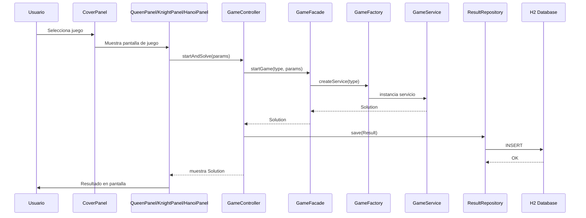

# Arcade de Puzzles Lógicos

  

## Tabla de Contenidos
1. [Descripción General](#descripción-general)  
2. [Arquitectura del Sistema](#arquitectura-del-sistema)  
3. [Estructura del Proyecto](#estructura-del-proyecto)  
4. [Módulos y Paquetes](#módulos-y-paquetes)  
5. [Flujo de Operaciones](#flujo-de-operaciones)  
6. [Arranque y Configuración](#arranque-y-configuración)  
7. [Uso de la Interfaz](#uso-de-la-interfaz)  
8. [Principios de Diseño](#principios-de-diseño)  
9. [Dependencias](#dependencias)  
10. [Roadmap & Futuras Mejoras](#roadmap--futuras-mejoras)  
11. [Contribución](#contribución)  
12. [Licencia](#licencia)  

---

## Descripción General
**Arcade de Puzzles Lógicos** es una aplicación de escritorio en Java que simula una máquina arcade con tres juegos clásicos de lógica y álgebra:

- **N Reinas**: Coloca N reinas en un tablero sin que se amenacen.  
- **Knight’s Tour**: Mueve un caballo para cubrir todas las casillas de un tablero.  
- **Tower of Hanoi**: Traslada discos de un poste a otro en el mínimo de movimientos.

Incorpora diseño por capas (Spring Boot MVC + JPA + H2) y frontend Swing con estilo retro.

---

## Arquitectura del Sistema
```mermaid
flowchart LR
  subgraph UI [Swing Frontend]
    A[CoverPanel: Portal de Juegos]
    B[QueenPanel]
    C[KnightPanel]
    D[HanoiPanel]
  end
  A --> B & C & D
  B & C & D --> E[GameController]
  E --> F[GameFacade] --> G[GameFactory] --> H[GameService< >]
  E --> I[ResultRepository (JPA)]
  I --> J[H2 Database]
```

---

## Estructura del Proyecto

```
src/
├── main/
│   ├── java/org/example/arcade/
│   │   ├── ArcadeApplication.java
│   │   ├── controller/
│   │   ├── factory/
│   │   ├── facade/
│   │   ├── model/
│   │   ├── repository/
│   │   └── ui/
│   └── resources/
│       ├── application.properties
│       ├── fonts/ArcadeClassic.ttf
│       └── images/*.png
└── test/
    └── java/org/example/arcade/
```

---

## Módulos y Paquetes

| Paquete      | Descripción                                      |
|--------------|--------------------------------------------------|
| `controller` | Orquesta la lógica de juego y persistencia       |
| `factory`    | Crea instancias de cada servicio de juego        |
| `facade`     | Simplifica la interacción lógicas + persistencia |
| `model`      | Entidades JPA (`Result`), DTOs, enums            |
| `repository` | Spring Data JPA para `Result`                    |
| `ui`         | Swing: `CoverPanel`, `QueenPanel`, etc.          |

---

## Flujo de Operaciones



---

## Arranque y Configuración

1. **Clonar repositorio**  
   ```bash
   git clone https://github.com/tu-usuario/arcade-puzzles.git
   cd arcade-puzzles
   ```
2. **Configurar H2** en `src/main/resources/application.properties`  
   ```properties
   spring.datasource.url=jdbc:h2:mem:arcade;DB_CLOSE_DELAY=-1
   spring.datasource.username=sa
   spring.datasource.password=
   spring.jpa.hibernate.ddl-auto=update
   ```
3. **Compilar y ejecutar**  
   ```bash
   mvn clean install
   mvn spring-boot:run -DskipTests -Dspring-boot.run.jvmArguments="-Djava.awt.headless=false"
   ```

---

## Uso de la Interfaz

1. **Menú Retro**: Selecciona un juego en la pantalla principal con portadas e iconos.  
2. **Barra Superior**: Ajusta parámetros (`N`, posición, discos) y haz click en **Resolver**.  
3. **Volver**: Usa el botón ◀ **Volver** para regresar al menú principal.  
4. **Historial**: Consulta resultados previos en la opción **Historial**.

---

## Principios de Diseño

- **SOLID**: Clases cohesionadas, dependencias invertidas con Spring.  
- **Patrones GoF**:  
  - *Factory Method* en `GameFactory`  
  - *Facade* en `GameFacade`  
- **MVC**: Separación UI (Swing), lógica (Service), datos (JPA).  
- **Tipografía y Estilo**: Fuente retro `.ttf`, Look & Feel Nimbus, paleta oscura/neón.

---

## Dependencias

- **Spring Boot Starter** (core)  
- **spring-boot-starter-data-jpa** (Hibernate + JPA)  
- **H2 Database** (embebida)  
- **Jackson Databind** (ParamsConverter JSON)  
- **JUnit 5** (tests)

---

## Roadmap & Futuras Mejoras

- 🖌️ Modo manual interactivo con animaciones.  
- ⏱️ Cronómetro y sistema de puntaje.  
- 🌐 Modo multijugador en red.  
- 📊 Dashboard web con historial y estadísticas.

---

## Contribución

¡PRs bienvenidas!  
1. Haz *fork* y crea rama `feature/tu-mejora`.  
2. Añade tests unitarios.  
3. Envía *pull request* describiendo tu cambio.

---

## Licencia

Este proyecto está bajo la **Licencia MIT**. Consulta el archivo [LICENSE](LICENSE) para más detalles.

